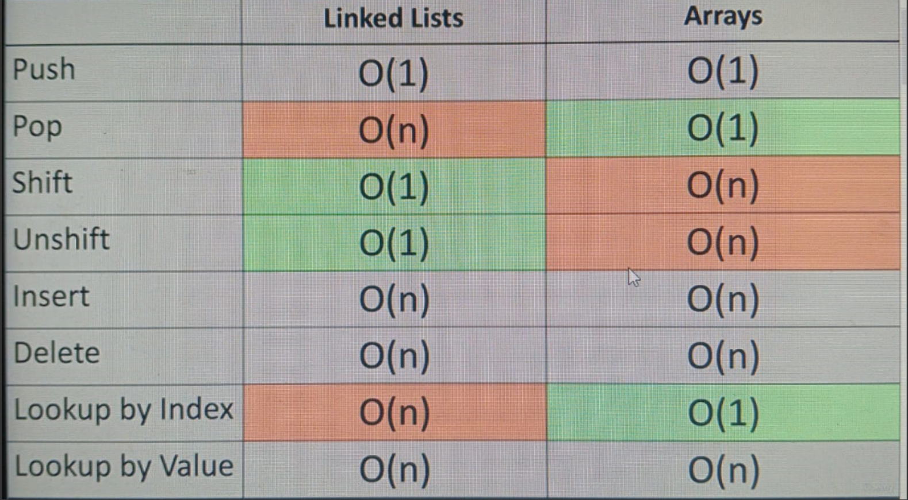
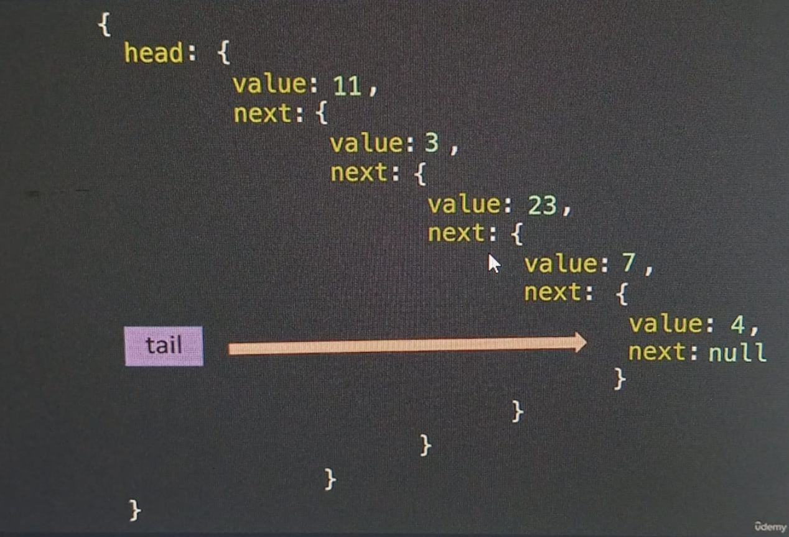

<h1>17. Linked List: Intro</h1>

## Already know about it. 

<h1>18. LL: Big O</h1>

<h1>19. LL: Under the Hood</h1>

### A Node a both a value and a pointer. 

### This is how linked list look under the hood. 

<h1>20. LL: Constructor</h1>

    Data Science and Artificial Intelligence 

    Computer Science and Information Technology

    Electronics and Communication Engineering	EC

    Electrical Engineering EE
 

<h1>Start</h1>
<h1>21. Coding Exercises (Important)</h1>
<h1>22. LL: Push</h1>
<h1>23. LL: Pop - Intro</h1>
<h1>24. LL: Pop - Code</h1>
<h1>25. LL: Unshift</h1>
<h1>26. LL: Shift</h1>
<h1>27. LL: Get</h1>
<h1>28. LL: Set</h1>
<h1>29. LL: Insert</h1>
<h1>30. LL: Remove</h1>
<h1>31. LL: Reverse</h1>